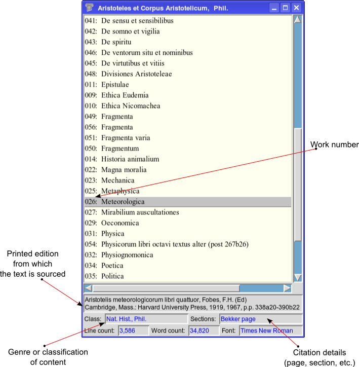

++++++++++++++++
Proteus
++++++++++++++++

Description
___________

Proteus is a decoder and converter for the ancient Greek and Latin
texts of the TLG and PHI digital libraries.
The TLG/PHI databases can be searched via a user interface (GUI) and
complete texts can be extracted as pdf documents, plain Unicode (utf-8) text
or as \LaTeX\  source code for further processing.

Introduction
____________

The TLG [#]_ digital library contains classical Greek texts encoded in a sui generis
format called BetaCode_.  This format is very efficient [#]_ but it is not
directly readable by word processors or text editors.  There are programs [#]_
that can search the TLG database for words or phrases and display chunks of text
but cannot display or extract complete texts. The aforementioned also apply to the Latin corpus
(PHI CD5) [#]_ and Papyrological/Epigraphical corpus (PHI CD7) [#]_ of the Packard Humanities Institute.

**Proteus** can extract complete texts from these corpora and translate the Beta
Code into Unicode (utf-8) [#]_ text, or into pdf documents for editing or
printing. Optionally it can deliver the \LaTeX\ source code used to generate the
pdf for custom typesetting of the texts.

It provides a convenient interface for searching each corpus canon for an author
and for selecting particular works from each author for conversion and viewing.

It can also serve as a useful utility when searching for authors since it
displays geographical, chronological and genre data for each each author/work
(when these are available).

Proteus is not suitable for word searches.  If you need to search the TLG/PHI
for words or phrases, use Diogenes_. This is by far the best tool for searching
or browsing the TLG database, and its free.

Screenshots
___________

The Author Selection List
-------------------------

.. figure:: src/manual/images/authors-en.png
   :scale: 100
   :align: center
   :alt: Author Selection List

The Texts Selection List
------------------------

System Requirements
___________________

- GCC and GNU make
- Perl (version 5.8.6 or later), and the modules, Perl-Tk, Storable and
  File-Slurp
- TeX installation including the packages XeTeX, xtab and xgreek
- Unicode Fonts that include the Greek and Greek Extended  ranges.
- TLG and PHI5/7 CDROMS.

Building and Installing
_______________________

- Copy the contents of the CDROMS to /usr/local/share/CDROMS.
  The expected directory structure is as shown bellow::

              /usr/local/CDROMS/
                            ├── phi5
                            ├── phi7
                            └── tlg

  Should you wish to put the CDROMS somewhere else you need to edit the
  first 3 lines of the configuration file **proteusrc** to reflect your chosen
  locations

- Clone Proteus from GitHub::

          git clone https://github.com/proteusx/proteus.git

- Verify that your TeX installation has all the required components::

           cd proteus
           sudo make fonts
           make xetex_test

  If everything is in order, your default pdf reader will open displaying
  some readable Greek text.  If the command gives errors and no pdf is produced
  look at the log file ``test.log``  and check your
  TeX installation. You many need to update XeteX.

- Verify that Perl has all the required modules::

       sudo make perl_test

  This will test Perl and install the required modules automatically form CPAN.

- Build the binaries, the index and the documentation::

            make all

- Finally read the documentation (see ``doc/proteus-en.pdf``) and install Proteus::

           sudo make install

  Proteus will be installed in the directory ``/usr/local/proteus``.
  If you wish to install somewhere else, edit the variable ``INSTAL_PREFIX``
  in the makefile.

Uninstalling
____________

To completely clear Proteus from your system::

      sudo make uninstall

Using Proteus
_____________

You can start Proteus from the start menu.  Usually found under
Applications/Office. Alternatively type **proteus** in a terminal.

The documentation provides detailed instructions and examples.

When running Proteus for the first time, a hidden directory ``.proteus``
will be created in your home directory to keep your personal defaults and output files.

Also, you may be requested to point the directories where the TLG/PHI
files are located. These locations will be stored and thereafter
Proteus will not ask again unless there is a change.
These locations can be altered from "Files", "Corpus Directories".
The default location for output files (pdf, utf, etc.) is the
subdirectory ``~/.proteus/books``.  You can later change this
to wherever you like, via the menubar "Files", "Output Directory".

Installing Proteus from the release
___________________________________

A release is provided with ready built binaries, index and documentation.

- Download and unpack the contents of the compressed release archive somewhere in your home directory.

- Find the manual in the ``doc`` subfolder and follow the step by step installation guide.

---------------------------------------------------------------------------------------------

.. [#] Thesaurus Linguae Grecae is a digital library in a CD-ROM and it contains
   all the literary texts written in the Greek language from the time of Homer
   until 1453 A.D.  See: http://www.tlg.uci.edu

.. [#] The Greek texts occupy about 600 Mb (uncompressed), and the Latin texts
   about 80 MB.

.. [#] Diogenes, Musaios, Antiquarium, et. al.

.. [#] PHI5 is a Latin language equivalent of the TLG.  It contains virtually
        all classical Latin literature through to A.D. 200 and some biblical
        texts in Latin, Greek, Coptic, Hebrew and English. For the list of contents
        see:
        https://web.archive.org/web/20170623105104/http://latin.packhum.org/canon
        https://web.archive.org/web/20160803141809/http://www.indiana.edu/~letrs/text-tools/textlists/phibibliog.html

.. [#] PHI7 includes a large collection
        of documentary papyri and Greek inscriptions.
        https://web.archive.org/web/20080818140802/http://132.236.125.30/content.html

.. [#] UTF-8 encoded plain text is compatible with MS Office Word and LibreOffice Writer.

.. _BetaCode: http://stephanus.tlg.uci.edu/encoding.php
.. _Diogenes: https://d.iogen.es/d/
.. vim: set syntax=rst tw=80 spell fo=tq:
