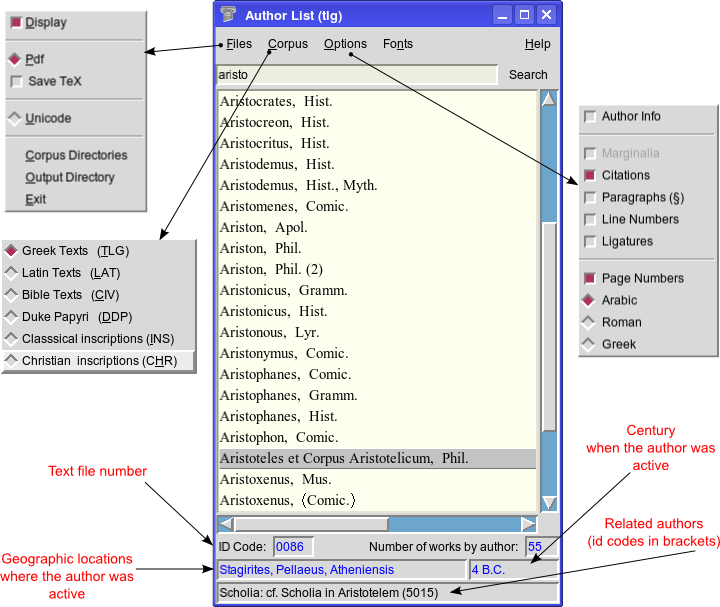

Work in Progress
++++++++++++++++
To be uploaded soon.

Description
___________

Proteus is a decoder and converter for the ancient Greek and Latin
texts of the TLG and PHI digital libraries.
The TLG/PHI databases can be searched via a user interface (GUI) and
complete texts can be extracted as pdf documents, plain Unicode (utf-8) text
or as \LaTeX\ source code for further processing.

|

.. class:: center

   The Author Selection List

|
|

.. class:: center
.. figure:: src/manual/images/works-en.png
   :scale: 100
   :align: center
   :alt: Texts Selection List

   The Texts Selection List

.. vim: set syntax=rst tw=80 spell fo=tq:
